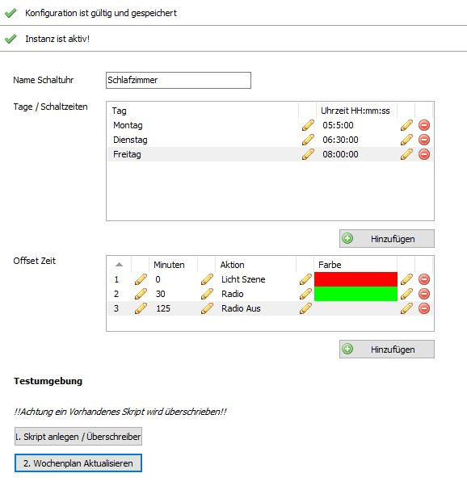
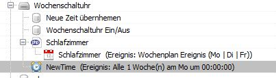
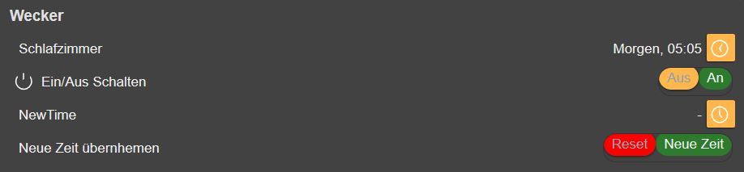
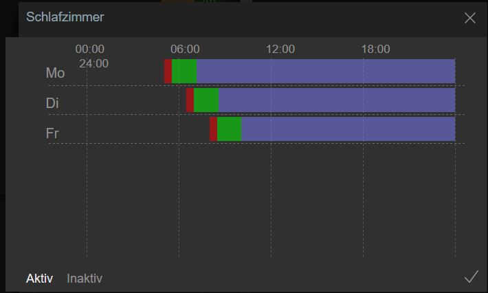

# Wochenschaltuhr / WeeklyTimer
Dieses Modul basiert auf dem Wochenplaner von IPS.
Es können die Wochentage und Uhrzeiten über das Konfigurationsformular eingestellt werde. 
Außerdem können die Startzeiten über das Web Front verändert werden.
Über die Reset Funktion im Web Front wird die Ursprungs Konfiguration geladen. 

### Inhaltverzeichnis

1. [Funktionsumfang](#1-funktionsumfang)
2. [Voraussetzungen](#2-voraussetzungen)
3. [Software-Installation](#3-software-installation)
4. [Einrichten der Instanzen in IP-Symcon](#4-einrichten-der-instanzen-in-ip-symcon)

### 1. Funktionsumfang

* Erstellen einer Wochenschaltuhr (Wochenplan) über ein Konfigurationsformular
* Beliebige Kombination von Wochentagen (jeder Tag darf nur einmal vorkommen).
* Erstellen Aktionen im Konfigurationsformular.
* Einstellen der Offset Zeit für jede Aktion.
* Erstellen eines Skriptes welches vom Wochenplan aufgerufen wird. 
  Wenn das Skript übers Modul Aktualisiert wird, wird dieses Überschrieben!
* Ändern der Wochentage und der Start Uhrzeiten übers Web Front
* Reset der Wochentage und der Start Uhrzeiten übers Web Front. 
  Es werden wieder die Tage und Zeiten aus dem Konfigurationsformular übernommen.

### 2. Voraussetzungen

- IP-Symcon ab Version 4.3

### 3. Software-Installation

Über das Modul-Control folgende URL hinzufügen.  
`https://github.com/Matzel687/IPSWochenschaltuhr.git`  

### 4. Einrichten der Instanzen in IP-Symcon

- Unter "Instanz hinzufügen" ist das 'Wochenschaltuhr' / 'WeeklyTimer'-Modul unter dem Hersteller '(Matzel687)' aufgeführt.  

### Beispiel Konfigurationsformular

### Vorgehensweise
1. Name Schaltuhr eintragen
2. Wochentage und Uhrzeiten festlegen (keine doppelten Tage erlaubt.)
3. Offset Zeit festlegen. (Jeder Wert darf nur einmal vorkommen.)
   Die Offset Zeit wird immer auf die Ursprungs Schaltzeit addiert.
4. Button "Skript anlegen" klicken.
  * Wenn später eine Aktion Hinzugefügt wird muss das Skript neu angelegt werden.
    Achtung Das alte Skript wird überschrieben! Vorher den Inhalt sichern. 
5. Button "Wochenplan Aktualisieren" klicken.
  * Wenn Wochentage oder Offset Zeiten geändert wurden muss der Wochenplan Aktualisiert werden. 

### Objektbaum 

### Beispiel Objektbaum / Links für Web Front Anzeige

### Beispiel Web Front

### Wochenplan

### Tage und Uhrzeit über Web Front ändern

### Vorgehensweise
1. Wochentag/e und Uhrzeit auswählen.
2. Dialog schließen
3. Im Web Front auf "Neue Zeit klicken"